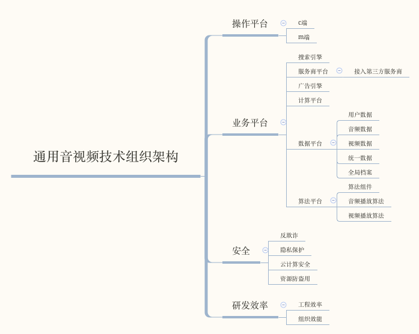

<h2 align="center">通用音视频播放平台</h2>
#### 编写原因:通往全栈之路中的一个跨越点.
#### 使用工具:VUE全家桶+EXPRESS全家桶.

---

## 通用音视频技术组织架构

#### 该项目front 实现其中的C、M端，api

## 更新说明

#### 初始化vue2018年04月25日17:52:59

c端vue

#### 创建于2018年4月24日14:04:09